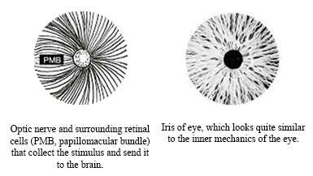

# An Explanation
###### Various types of OOBE techniques and states

This is, is essence, a How-To book, but what it describes steps outside the boundaries of our current understanding of reality and even of ourselves.  What is written here may sound like sound like gibberish, or at best, grammatical madness, to many.  Even worse, those who believe its claims and follow the instructions may run the risk of loosening their grasp on reality.  Others will appear to have lost their minds, when in fact, they have simply found the secret door that frees them from the constraints that have been forced upon our minds for so long as to be genetically passed on for millions of generations.  

Exploring into unknown territory is always fraught with danger and unimaginable challenges, but history is a testament to our insatiable need to discover, either for survival or knowledge or power, which has often eclipsed our greatest fears, at least for our ancestors. Today, it seems like there is little room for discovery for the average person.  Unless you have access to to resources that only large governments, corporations and the uber-wealthy seem to have, you will not be exploring new frontiers of technology, medicine, geography, cosmology, education, or anything else that we might have the desire to explore.  Even though the need for improvement in those areas is woefully obvious to everyone, we are resigned to knowing there is nothing we as an average individual can do.  On the other hand, exploring the inner worlds requites only courage and discipline, and no amount of power or security will be an advantage.

While this may be a How-To book, it only describes a process that I used.  This process has not been tested with anyone else, and is, as best, simply one process that does for one person.  As the reader will see in the Journal section of the book, the process began as a series of seemingly random and crazy  

**The Reader**

This book is intended for people who are already familiar with the paranormal, such as out-of-body experiences and altered states, and have some familiarity with mystical traditions of the past.  These can include anything from ancient religious texts to indigenous rituals.  The reader should also be familiar with basic psychology, physiology, history, and technology.  In general, this book was written for the open-minded *Renaissance man*.  This is not to suggest that only such people can be MEX explorers, but this book happens to use a wide variety of such references and concepts.

An example of this is *Appendix B “On OOBE Review”*, where various types of OOBE experiences are briefly touched describes.  While exploring the cognosphere is not necessarily an OOBE experience, it can lead to, and seems to have some overlap, with  OOBEs.

### The Process - Level 1

To begin, it is probably best to sit in a time and place that will be relatively quite and not too bright.  One you get the hang of it, you can be in any position in almost any environment, dark or light.  Close your eyes, and if it helps, cover your eyes so as to not be distracted by light.

Stare into the black void of nothingness.  Look ‘into’ the blackness with focus and intention.  Imagine that you are looking into am infinite space that happens to be empty of everything, including light.  For example, imagine you have standing at the very edge of the expanding universe, beyond all the stars, looking out into the nothingness.

Focus your eyes to some imaginary point a comfortably distance away.  This is how you convert nothingness to something, at least as far as your brain is concerned.  Focusing your sues ‘into’ the blackness tells the brain that the blackness is actually a space that is lacking any light, and the brain will respond similar to how it would respond to being in a totally black room. This also acts a bridge between the imaginary imaginary concept of space and your brain accepting it as a reality, because focusing your eyes will trigger your brain's preprogrammed wiring to process any information it may receive in a matter you can understand.

The brain is not only a state-of-the-art pattern recognition machine, it is addicted to pattern recognition.  So much so that it will even find patterns looking at uniform field of light (or no light, in this case).  Forms of the auto-hallucinatory abilities have various names, such as the *Ganzfelk effect*, *Charles Bonnet syndrome*, *Closed-eye hallucinations*, and even colloquial terms like *prisoner's cinema*.  In her book *'Caves and the Ancient Greek Mind: Descending Underground in the Search for Ultimate Truth*', author and and PhD from the Institute of Archaeology of the Academy of Sciences of the USSR, Yulia Ustinova explains how the Ancient Greeks would enter pitch-black caves in order to receive their visions.  

In short, the brain will create its own stimulus when there isn't any readily available externally.  It really does not like being bored.  So, shortly after you have entered your ‘cave’, the brain will begin to create some sort of visual stimulus.  At first, the stimulus will be slight.  Whether this is due to the brain's laziness, efficiency, because it’s doing something new and therefore using less developers neural paths, or some other reason, is a question for those who understand more about how the brain works.  Regardless, expect to see meaningless and barely preceptable shapes, lines, and forms. Some are so imperceptible that you won’t be able too tell of you are actually seeing them or if you only think you are seeing them. 

You can test this yourself by thinking of something like a shape.  Don’t get too fancy at first.  Start with imagining a circle or a triangle in the middle of the void.  Put you attention on the outline that you have imagine, and they try and ‘see’ the shape.  Once you recognise the shape visually, change ti another shape.  In my experience, that change takes anywhere from less than a second to 5 seconds.

Have you ever listened to a repetitive sound, like a ticking clock or footstep in a hall, and noticed how the pitch of the sound can change just by your imagination?  For example, when listening to the tik-tok of a clock, you might hear the tik being a slightly higher pitch that the tok, but if you imagine the tok being higher that the tik, you will hear that instead.  You can change tik-tok to tok-tik in your head just by using you imagination.

In this context, you may find it difficult to distinguish between ‘seeing’ and ‘being aware of’.  It will be useful to try and comprehend how they are different and how they are the same.  As you contemplate on this, consider how you can ‘see’ your hand even when your eyes are closed.  This is a form of *proprioception*, when your nervous system knows *where* your hand is, and your brain knows *what* the hand is, and together they form an accurate signal of the hands that the brain responds to by forming a phantom or *kinaesthetic* ‘image’ of your hand which you can sense and sometimes see with your eyes closed.

Now comes the tricky part.  After some time, which could be minutes or hours, the brain MIGHT increase the stimulus by introducing one of more dots of light, like the smallest stars in the sky, or increase the light in the barely preceptable forms, making them easier to see. The trick is to catch these random stimuli by focusing your attention on them.  It’s a bit like trying to catch a wave when you are surfing, and like surfing , and just about everything else, practice makes perfect.  If the stimulus disappears, wait for another.

You’ll find that staring directly at the stimulus is impossible, as it will avoid direct observation or just disappear.  This is because the the stimulus is activating the *rods* in your eye, not the *cones*.  You can read more about eye physiology in the chapter on physiology.  For now, just know that you want to keep the point of light at 20 degrees offset from your centre of vision.  That zone it illustrated in the image below.

If you can ‘catch’ the stimulus, you will find the stimulus begins to increase, sometimes dramatically.  Because the only way the brain can create visual stimulus it to stimulate the visual cortex, which is wired to the optic nerve, optic disk, and retina, we can expect to see something that kinda looks like the shape of an optic nerve, optic disk, and retina, which also happens to look like an eye. 

At first, you may see something like a barely perceptible doughnut shape, or some other type of ring-with-a-hole-in-it, and because a simple doughnut floating is space is almost as boring as empty space, expect this barely preceptable doughnut/eye shape to move, change, disappear, reappear, and generally be unstable. You may wonder if everyone has te same experience.  In our experiments with others who have practices this, they all experience similar visual,  This would suggest that it is the form and function of the eye/brain that determines the visuals.

At the stimulus increases, we will naturally begin to see forms that replicate the nervous system of the eye, as that is the form of the source of input that the brain has evolved to process.  You will begin to see interesting shapes and colours that look random, but also organic.  In my case, the form looked like an optic nerve, or at least modelled somewhat after the actual blood-and-guts of an optic nerve, as opposed to the clean and tidy drawings of an optic nerve as shown above.  The image on the right is derived from an actual photograph of the optic nerve as in exists in the eye, and is a close approximation of the image created by the internal stimulus.

There is one small side-effect that is interesting.  Chances are, you have not been doing the practice described above on a daily level already, which means that when you do this practice you will be working with new or weak neural pathways.  As these pathways grow, the experience will become easier and more visual.  In this way it is similar to learning to play the piano or doing maths in your head; the more you do it, the easier it gets and the better the output.  However, once these neural pathways begin to grow, they may start to contribute to your daily experience of reality.  We have seen this phenomena with people who are exposed to virtual reality… their brain not only begins to work differently, but the VR processing skills will deploy themselves to the *de facto reality* of everyday life.  This can be greatly beneficial, as we can see in the way we use VR to improve and even help heal our brains from diseases such as Alzheimer's, stroke, depression, schizophrenia, epilepsy and post-traumatic stress disorder.  The potential downside is that the brain may get confused between VR and *de facto reality*, but this is really only a problem when the person already has some underlying psychological issues.  So, if you have underlying psychological issues, continue hacking your brain at your own risk.

