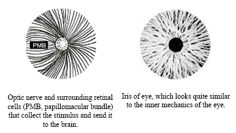

# The Process

###### Step-by-step How-To

### Switch brain from perceive-mode to create-mode.

To begin, it is probably best to sit in a time and place that will be relatively quite and not too bright.  One you get the hang of it, you can be in any position in almost any environment, dark or light.  Close you eyes, and if it helps, cover your eyes so as to not be distracted by light.

Stare into the black void of nothingness.  Don't simply 'see' that is blackness/nothing there; look into the nothingness. Try and focus your eyes to some imaginary point a comfortably distance away.  This is how you convert nothingness to something, at least as far as your brain is concerned.  Focusing your sues 'into' the blackness tells the brain that this the blackness is actually a space that is lacking any light, and the brain will respond similar to how it would respond to being in a totally black room. This also acts a bridge between an imaginary concept and your brain accepting it as a reality.  While you rationally know that this is not a empty dark space, focusing your eyes will trigger your brain's preprogrammed wiring to process any information it may receive.

The brain is not only a state-of-the-art pattern recognition machine, it is addicted to it.  So much so that it will even find patterns looking at uniform field of light (or no light, in this case).  Forms of the auto-hallucinatory abilities have various names, such as the *Ganzfelk effect*, *Charles Bonnet syndrome*, *Closed-eye hallucinations*, and even colloquial terms like *prisoner's cinema*.  In her book *'Caves and the Ancient Greek Mind: Descending Underground in the Search for Ultimate Truth*', author and and PhD from the Institute of Archaeology of the Academy of Sciences of the USSR, Yulia Ustinova explains how the Ancient Greeks would enter pitch-black caves in order to receive their visions.  

In short, the brain will create stimulus when there isn't any.  It really does not like being bored.  So, shortly after you have entered your 'cave', the brain will begin to create some sort of pattern.  While the brain demands activity, it is also very efficient, so it will only do the minimum amount of work required to create a visual stimulus, at least at first.  Because the only way it can create visual stimulus it to stimulate the visual vortex, which is wired to the optic nerve, optic disk, and retina, we can expect to see something that kinda looks like the shape of an optic nerve, optic disk, and retina, which also happens to look like an eye. 

Don't expect to see an eye staring back you, however.  Expect to see something like a barely perceptible doughnut shape, or some other type of ring-with-a-hole-in-it, and because a simple doughnut floating is space is almost as boring as empty space, expect this barely preceptable doughnut/eye shape to move, change, disappear, reappear, and generally be a bit illusive and hyperactive.

“Barely preceptable” means it might be so faint that you'll think you are imagining it, and in a way you are, in that your brain is creating this image out of nothing.  Still, a different part of your brain will insist "Hey, this isn't really here!", but in this case, both parts of your brain are correct.  

When you are staring into the blackness, can you imagine a circle or a triangle in that space?  Not so much that you can see it, but just able to 'see' the space it would occupy? 

Have you ever listened to a repetitive sound, like a ticking clock or footstep in a hall, and noticed how the pitch of the sound can change just by your imagination?  For example, when listening to the tik-tok of a clock, you might hear the tik being a slightly higher pitch that the tok, but if you imagine the tok being higher that the tik, you will hear that instead.  You can change tik-tok to tok-tik in your head just by using you imagination.

This is a bit similar in that you can create shapes using only your imagination. 

The brain is now sending a nominal stimulus to your visual cortex, which we “see”,  and a faint shape or movement in our field of vision.  “Seeing” in this context is more like “being aware of”, because there are moments when the form is so faint that it isn’t really being seen, yet you can identify it visually.  

> This is a bit similar to how you can “see” your hand even when your eyes are closed.  This is a form of *proprioception*, when your nervous system knows *where* your hand is, and your brain knows *what* the hand is, and together they form an accurate signal of the hands that the brain responds to by forming a phantom or *kinaesthetic* “image” of your hand which you can sense and sometimes see with your eyes closed.

The eye then receives this stimulus and sends it back to the visual cortex.  the visual cortex is both generating and processing its own stimulus, perhaps like a feedback loop.  Occasionally you might see a dot of light appear then disappear, or some other random and slight visual artefact. 

