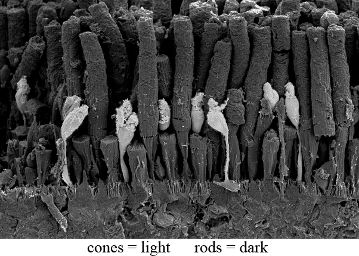
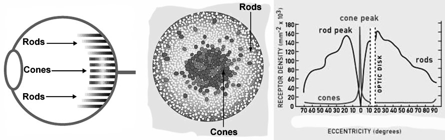
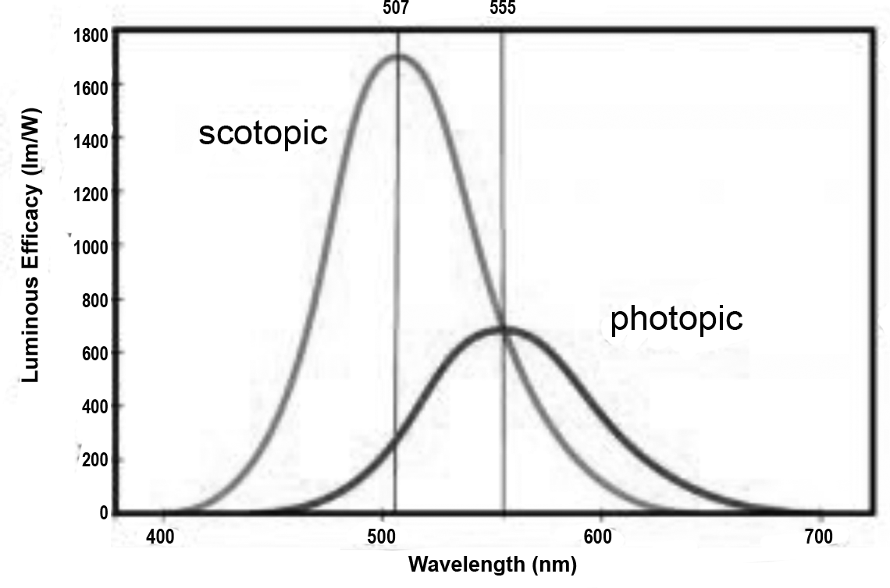

# Physiology

###### How and why does this work?

### How the brain processes images

Before considering the mechanics of sight, consider it miraculous super-powers.  For example, the resolution of eye has the ability to ascertain a the alignment of object within 5 seconds of arc.  This is equivalent to seeing the misalignment in headlights 39 miles away.  The eyes also sends about 1.25 gigabytes to the brain every second.  This equates to 108 terabytes a day, which means that every three hours your eyes send the same amount of data as that which is held in the American Library of Congress, or in less than two days is sends the equivalent of every book ever written in history. Of course, much of the magic of the eyes happens in the brain, which processes the never ending stream of data into something we can manage.  As you can imagine, this is a powerful piece of technology, so it may not be that surprising to discover it can do other things we have yet begun to imagine.

Relevant to our subject, it is only necessary we look as a few details about the eye.  

The retina in the eye has two major types  of cells; *rods* and *cones*. 

Rods, which only see in black and white, are more sensitive to light than cones and give us night-vision and peripheral vision, and cones, which dominate the centre of the retina and support full-colour, give us day-vision and centre-vision.

The visions produced by the rods is called *scotopic vision*, and the vision produces by the cones is called *photopic vision*.

The images that our brain is creating when we close our eyes are barely preceptable at first. The most likely reason for that is because the brain is creating a very weak stimulus.  Because the stimulus is weak is emulates the input that normally comes from the rod cells; those cells that are extremely sensitive to light.  As the rod cells have their own circuitry to the brain then stimulating these circuits would, presumably, create imagery that simulates rod cell input. 

Because these virtual images are scotopic, they can not be ‘looked at’ directly because the rod cells dominate the periphery of the retina, and cone cells dominate the centre of the retina, or *fovea*.

Knowing the above tells us that the barely preceptable grey images are scotopic, but if we see colour in our visions, then we are having a photopic vision.  In the beginning, it is usually the case that we start with scotopic visions and then move to photopic visions.  The assumption is, as we improve our brains ability to stimulate itself, the signal will become strong enough to create a colourful photopic vision.  

xxxxxxxxxxxxxxxxxxxxxxxxxxxxxxxxx

optic nerves and brain stem

https://www.google.com/search?q=optic+nerves+and+brain+stem&sxsrf=ALeKk03h8Fe10LpmZ2Ug0Ff9qWWLg2d3bw%3A1627958367650&ei=X6wIYYyLJ5DJ1sQP5POlkA4&oq=optic+nerves+and+brain+stem&gs_lcp=Cgdnd3Mtd2l6EAMyBggAEBYQHjoECCMQJzoECAAQQzoFCAAQgAQ6BQguEIAEOgsILhCABBDHARCvAToKCC4QxwEQrwEQCjoECAAQCjoFCAAQkQI6CggAEIAEEIcCEBQ6BwgAEIAEEAo6CAgAEBYQChAeSgQIQRgAULX4BliPqwdg2q0HaABwAHgAgAGWAYgBmReSAQQ5LjE5mAEAoAEBwAEB&sclient=gws-wiz&ved=0ahUKEwjMttnB6ZPyAhWQpJUCHeR5CeIQ4dUDCA4&uact=5

### How /why teh brain creates images

https://www.sciencealert.com/how-to-create-hallucinations-without-drugs-surprisingly-easy-science

https://royalsocietypublishing.org/doi/10.1098/rstb.2020.0233

### Images vs hallucinations

Enhanced vividness of mental imagery as a trait marker of schizophrenia? 

https://academic.oup.com/schizophreniabulletin/article/31/1/97/1884636

### Hallucination vs visions

https://sciencenorway.no/forskningno-norway-society--culture/hallucinations-or-spiritual-experiences/1438198

https://www.imagerynet.com/book/excerpts/visions.vs.hallu.html

@@@@@@@

**Peduncular hallucinosis (PH)** is a rare neurological disorder that causes vivid visual hallucinations that typically occur in dark environments and last for several minutes.
Peduncular hallucinosis - Wikipedia](https://en.wikipedia.org/wiki/Peduncular_hallucinosis#:~:text=Peduncular hallucinosis (PH) is a,and last for several minutes.)

@@@@@@@

[Charles Bonnet syndrome - NHShttps://www.nhs.uk › conditions › charles-bonnet-syndr...](https://www.nhs.uk/conditions/charles-bonnet-syndrome/)

Charles Bonnet syndrome ... Charles Bonnet syndrome causes a person whose vision has started to deteriorate to see things that aren't real (*hallucinations*). The ...

@@@@@@@

https://www.quora.com/Why-do-I-have-hallucinations-when-I%E2%80%99m-in-a-dark-room-They-aren%E2%80%99t-clear-hallucinations-but-just-warped-vision-vision-fading-out-etc

@@@@@@@

https://www.quora.com/Is-it-normal-to-hallucinate-in-the-dark

@@@@@@@

https://nobaproject.com/modules/sensation-and-perception

[Sensation and Perception | Nobahttps://nobaproject.com › modules › sensation-and-perc...](https://nobaproject.com/modules/sensation-and-perception)

by AJ Privitera · Cited by 8 — Our senses combine *to create* our perceptions of the world. ... This psychological process—making sense of the *stimuli*—*is* called perception.

@@@@@@@

Consciousness as a Physical Process Caused by the Organization of Energy in the Brain

https://www.frontiersin.org/articles/10.3389/fpsyg.2018.02091/full

