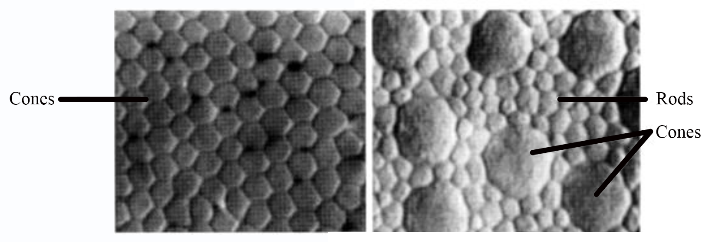
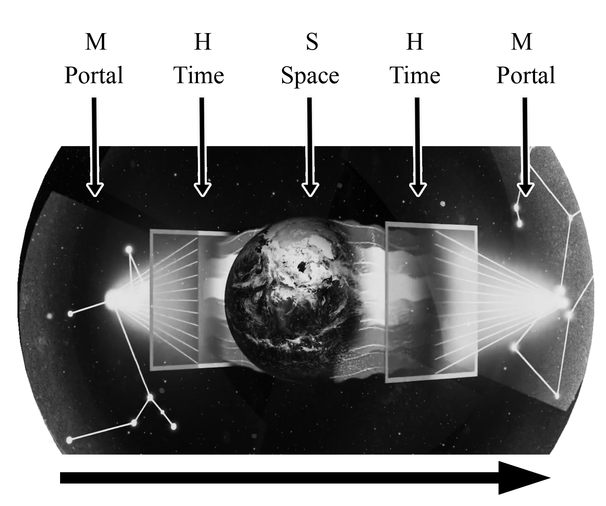
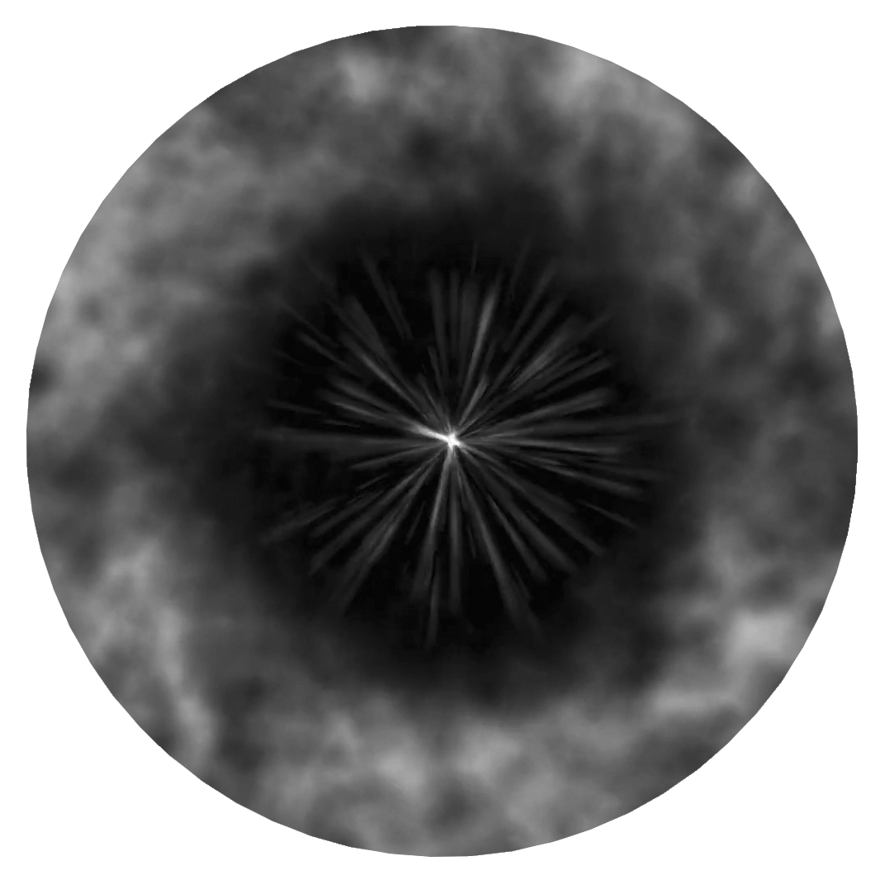
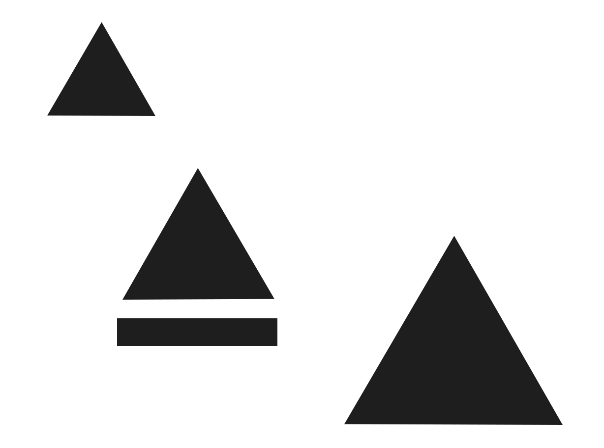
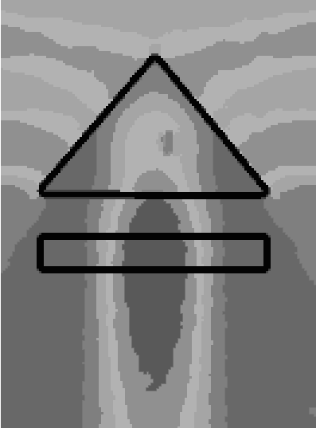
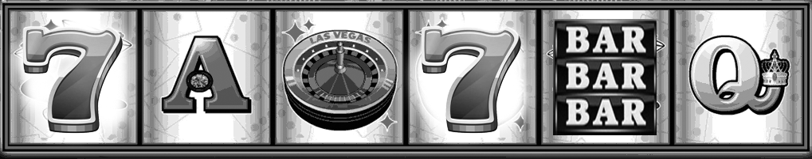
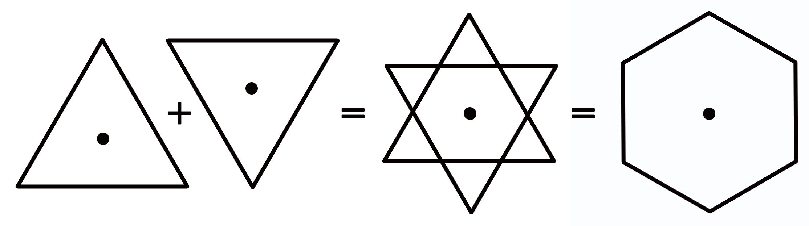
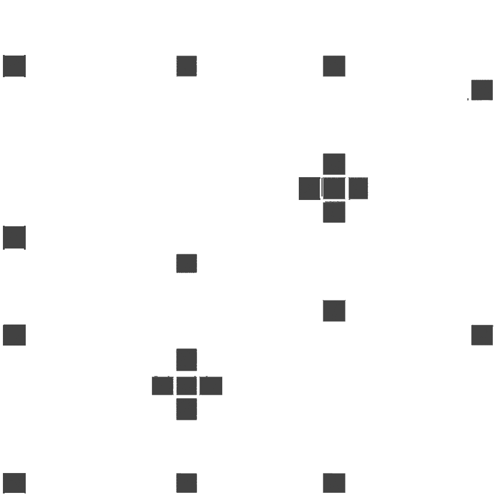

# Journal

### Journal entries with comments

What follows are the direct entries of selected journal entries regarding my meta-cognosphere experiences (MEX).  These entries were originally noted by hand in a small notebook, and some of what was written was not so clear at the time I transcribed them into this document.  After July 19, 2021, all notes are entered directly into this document.

**August 23, 2020 (Moon Wax 37%)**

> *Saw weak dot & circles. Focused until I saw the violet. Stayed with that until I found myself in another world floating over the a dark, seemingly dead and abandoned landscape of a formerly inhabited planet.  Housing structures were all below ground level with only small windows and the roofs above ground level.*  The landscape was dry and harsh, with no sign of vegetation, present or past.  Similar to eastern Sahara, or the Atacama desert in Chile, or even the images we have seen of the Mars landscape.
> &nbsp;
> *Exited, reentered.*
> &nbsp;
> *Found myself in a dark cave, at night. The roof of the cave had a large hole through which I could see the night sky.  Extremely beautiful.*  Tried to exit through the hole, but could not manage to move myself up.
> &nbsp;
> *Exited, reentered.*
> &nbsp;
> *Moved to a new some city park in the middle of the day, bright, people gathered for some sort of march, buildings, etc. All-in-all, a fairly typical day in a big city.*
> &nbsp;
> *Exited, reentered.*
> &nbsp;
> *I travelled over land like a filming drone, but only able to see out a limited “window” or field of view, similar to wearing a welders mask.  Appeared to be in some type of rural farmland, similar to that famous painting of a lone house on a hill ("Christina's World", Andrew Wyeth), but flatter.  Long, straight, narrow dirt roads, all very green. I realised I could control my direction of view by my intention towards an object, not by simply trying to change the field-of-view.  There had to be a focal point of attention which acted like an anchor or pivotal centre, such as a mailbox on the corner of a dirt road, a point in a creek, a rock, etc.*
> &nbsp;
> *Exited back to origin location.*
> &nbsp;
> *Found the purple light, but it was weak.*
> *Saw a form of a tetrahedron, black or shadowed, then a flood of other shapes followed.*
> *Violet light appeared, very strong and from different angles, sources.*
> *Heard a woman's voice explaining things - don't remember what she said.*
> *After a few moments of intense violet light my consciousness simply shut down, like passing out, at least that part that was aware of what I was doing.*

**Post notes:** This was one of the first explorations of this process.  I has previously practised a few times by simply closing my eyes and looking into the void, with little to report. This was a very long and intense session, so perhaps I blacked out because I reached my limit?  As fascinating as these experiences are, they do take a bit of a toll on my awareness, similar to how a child can become overwhelmed at a carnival, but I suspect this sort of ‘travel’ has other limitations I am not at all aware of.  For example, I learned there are limitations to movement, some based on my lack of ability, but other based on external conditions.  I had no idea where I would end up each time I reentered, or what abilities I may need. For example, I had no problem moving over the dead landscape or the city park simply by intention, but in the country field, I needed to focus on objects, almost like sling-shooting myself from point to point.

**August 24, Monday, 2020, 16:00 (Moon Wax 37%)**

> *Went to the rooftop and sat under the very bright and warm winter sun.  Put on blinders to block the sun from my eyes. Began to see yellow targets with the violet inside. Saw an eye, with more violet inside eye.  With more focusing I could see part of the face.  It was old and fierce, but very beautiful. Saw eye inside black trigram. Target continued during conversation with Adri.*

**Post notes:** A ‘target’ is a visual focal-point.  Usually they are the bits of violet or purple, but this time they were yellow, with violet inside the yellow.  Perhaps because I was sitting outside under the sun?  The image of a single eye is such a classic image that it's hard not to believe I saw it simply because it was ingrained into my own unconscious, even more so for eye in the triangle.  On the other hand, these are both archetypal images that one would expect to come across if they were travelling beyond this material world, like landmarks or buoys in the wilderness.  I was not surprised to see them, but I was surprised to see the (partial) face of the fierce, old and beautiful man.  Who was that?  What did he represent?  Never saw that face before.  The face was not in full technicolor, but in shades of blue-grey within the blackness.

Adriana was tending to the rooftop garden and we had a conversion while all this was happening.

**August 25, Tuesday, 2020, 12:00 (Moon Wax 45%)**

>Violet “sprites”, 3 or 4, descending from upper left.
>Opened portal to other place.
>Exceptionally immersive.  First saw smoke, then streets, canal, boxy building, and the military with guns on street during a demonstration.
>Saw Latin characters.
>Learned how to better move my vision with gentle and “sincere” intention.  It was like my awareness was a drone.

**Post note:** Usually the violet flames start from a centre point and grow, but this time the were incoming from the periphery of my vision.  In the world of NLP (Neuro Linguistic Programming), moving the eyes to the upper-left represents a “visual construct”, and indicates that the brain is creating a visual image, something it hasn't seen before, a fantasy.  This makes sense, as I have to assume my brain is creating not only the images, but the whole immersive experience. As to whether this is a fantasy or not, I guess time will tell, but to believe all creations of the brain are fantasies would be silly and dangerously shortsighted.

**August 26, Wednesday, 2020, 11:00 (Moon Wax 60%)**

>Took some ashwagandh.  Felt that I  could see optic nerve better.
> &nbsp;
>Heard a voice that spoke in a fashion that similar to the style of the Wilhelm-Baynes translation of the I-Ching. Only remember last phrase: "Renew/Renovate/Revise your vision".  

**Post notes:** ‘Ashwagandh’ is a common and ancient nootropic herb used for stress, insomnia, blood pressure, immune system and calming the brain.  It is evergreen shrub that grows in Asia and Africa.  The voice did not actually say the words “Renew/Renovate/Revise”. It was another word, or sound, that my brain understood as “Renew/Renovate/Revise”. It seems I was being spoken to in a non-human language that I somehow understood on some level enough for my brain to know how to translate.

**September 4, Friday, 2020, 10:30 (Moon Wan 94%)**

> *After an hour of attempting I stopped, took off bandanna, and rolled onto my side in defeat.  Immediately I saw some movement in centre of field of vision. As soon as I focused on it it became a “hole”.  In the centre was a night sky and one small star, or dot of light, similar to the cave hole, but far more dramatic.  Around the hole was wildly moving shapes, similar to fire, but only dark shapes. As I focuseAttractionsd on the star I saw it begin to form more stars, then lines forming 2D shapes, then 3D shapes!*

**

> *Then they seemed to move like constellations across the dark sky.*  
> &nbsp;
> *This state was remarkably stable, as I lost it a few times but was able to recover it quickly.*
> *After 10-15 minutes of this it changed to a flood of -- everything -- all shapes, things -- Some things I recognised, most things I did not.*
> *The hole and cave disappeared, but before that, the wild activity around the inside edge of the hole increased appearing almost violet or threatening.*
> &nbsp;
> *I attempted to get closer to the hole in the hopes of exiting through it, but it was difficult to know how to move.  Using intention I did get closer, but the movement was limited and haphazard. My first thoughts were “this must be the world of archetypes that Plato claimed was an actual reality”.*
> &nbsp;
> *It is still a mystery to me how to invoke this state. It seems to happen randomly.  During this state there was a little bit of light in my environment which made the field of vision less black.  When I blocked that light, to increase the blackness, the vision diminished.  So... too much light or too little light is not conducive?*

**Post notes:** This flood of images seemed similar to an ayahuasca experience I had 15 years earlier, where what seems like everything was being shown to me in an super-fast image sequence that after a few minutes I could no longer support.  In this experience it felt like only the archetypes were being shown to me, but while the ‘reality’ I was in was more immersive, the images were beyond the hole, and all in 1 or 2 colours, cyan-ish/green-ish - not violet.  Maybe sky-blue-ish.  

**September 4, Friday, 2020, 16:00 (Moon Wan 94%)**

> *On the rooftop. For the first time I saw expanding circles, rather than contracting .  Very satisfying feeling.  After a few minutes I heard the words "Open your eyes".  I did not want to, and for a moment ignored the “message”, but then did.*

**Post notes:** Up until this experience, the violet light was the result of the concentration of contracting waves. This was the first time I saw expanding waves, even though there was no bright violet light at all. I was experiencing this for only 10-15 minutes (I think) when I heard the message. This message was very clear, but also felt very distant.  I suspect I was pushing myself too far, or exposing myself too much, or ‘going’ somewhere I should avoid.

**September 9, Friday, 2020, 10:30 (Moon Wan 57%)**

> *Contracting tunnel came on very fast.  Dark blue first, then violet. Entered quickly and saw a “reality” I choose not to enter... a thick gravestone with a cloth cover in a grave yard.  New/other realities did not appear.  Returned to tunnel entrance but only blackness appeared.  Then I saw a 1950's style space ship, lots of tubes and balls. Star-dots appeared, but faint and I was outside!*
> &nbsp;
> *Immediately fell asleep after experience... had following dream.*
> &nbsp;
> *I S.F.? Had needle through my hand, by doctor. It was OK, no pain. It was some sort of treatment. (acupuncture point?). In hospital... met a ginger, nice. We were talking about his “ADD”?, but it was some sort of immune deficiency issue, not attention deficit disorder.  He had to go into clinic, and it began to get dark - all were worried, then earthquake.  I collected my things, which took some time and was confusing due to the rubble, and headed outside. NEXT SCENE. In a small room, partly New York, partly Buenos Aires. In one moment I turned around and the room was reversed. Bed was on left, and the loft, before before on the right, was also on the left. Everything was reversed... Nothing damaged, but a bottle of urine was broken. Lots of piss on the floor. Next to the broken bottle was a simple mask.  Loft was not well fastened and kept falling.  Started to clean up.*

**Post notes:** The transition from optic nerve to optic flame was very clear this time. This is what the optic nerve image looks like, and the flame-like form it transforms into. Both of these images are typically a bright violet.

Unfortunately, I do not remember what “and I was outside!” refers to.  Outside the the tunnel? On the rooftop?  I also have no idea what “I S.F.?” refers to.  Perhaps it was a misspelled shorthand for "In San Francisco?", where I used to live.

In retrospect, this dream is loaded with symbolism, and was possibly prophetic.  While COVID-19 had been around in the news since January, 9 months earlier, and masks were being discussed, it would be months before anyone started getting injected with the vaccine, if that is what the needle in my hand represented.  On the other hand, I learned months after this dream that the location of the injection in my dream is where RFID chips are inserted with a syringe.  

In the original note I put a question mark next to ‘ADD’ because even though I heard with words ‘ADD’, it was not clear why we would be speaking about *Attention Deficit Disorder* with regard to immune deficiency.  However, *Antibody-Dependent Enhancement*, or ‘ADE’ as it is commonly called, applies perfectly, and is now a major problem with regard to the mRNA vaccines.  It may be that I heard ‘ADE’ in the dream, but wrote down ‘ADD’ because it was the only acronym that I knew at the time that sounded similar.

The earthquake could also be symbolic, as in a seismic social event resulting in a lot of broken and collapses institutions.  Or, it could be literal, and an earthquake is imminent. If I was in San Francisco, that would not be that unusual at all.  If there is an earthquake in San Francisco, prepare for a world of bio-chips and billions of sick and dead people from the mRNA vaccines.

**September 14, Monday, 2020 10:30 (Moon Wan 11%)**

> *Began immediately after waking.*
> *Saw pupil briefly, and it became a windows into other worlds. I didn't enter, but got closer.  Boats?*
> *Saw tetrahedron of light, also pyramids, and what might have been a simple thologram. Placing my awareness on it caused it to grow very fast into what looked like a giant molecule with countless generations.*
> *After the pupil, the violet light came. The light was more cyan-ish, sky-blue-ish.*
> *Was slightly more able to control its vision,  became very bright and persistent at times.*

**Post notes:** By ‘immediately after awakening’ I mean I awoke, closed my eyes, and immediately started to practice.  It does not mean is happened spontaneously and without effort as soon as I awoke. Over time, it was not uncommon to see the ‘pupil’, or hole, or tunnel-opening without seeing the violet light initially. The  geometrical shapes was becoming more prominent in my travels, but this may also be because I have just written a book that dealt with geometry and consciousness, which introduced the idea of a *tholon*, a self-similar tetrahedron.

**September 16, Wednesday, 2020 10:30 (Moon Wan 0.9%)**

> *Difficult to enter.  Saw ‘pupil’ and flame as two different things interacting with each other, but they were not being very compatible.  The pupil would eclipse the flame, and the flame would block the pupil.  I had to choose if I wanted to enter via the pupil or the flame.  I Choose flame... normal visions followed.*
> &nbsp;
> *Then saw stars through ‘broken ceiling’, but this time I could pass through the hole and enter the sky.  The sky was filled with stars, and also a planet. Approached the planet. At first it was hard to say if the planet's was organic or was created, but when I ‘entered’ the planet, I found myself in a crappy Korean supermarket.*

**September 17, Thursday, 2020, afternoon, (Moon NEW 0%)**

> *Had very weak vision of ‘ceiling hole’, but in that moment a striking image appeared outside the hole, like a Faberge decorated Easter egg (like example image shown), then other similar designs.  I was surprised by the clarity of the object and uniqueness or design... something I would never thought to imagine.*

**September 21, 2020, (Moon Wax 24%)**

> *Took almost an hour.*
> *Orion? pulsing light and dark.*
> *Eye eclipses the light.*
> *Blue, cyan, violet.*
> *Light most intense*
> *Vision of woman/angel on other side of void.*

**Post notes:** This time the stars looked like the constellation of Orion (below).  the word ‘eye’ also refers to ‘pupil’ and ‘opening of tunnel’, and the words ‘light’ and ‘flame’ are usually synonymous.  This was the first time I saw a being across the void or darkness.

**September 26, 2020, (Moon Wax 76%)**

> *Tunnel appeared spontaneously but could not focus to point.*
> *Very difficult to ‘enter’, focus point would evaporate before focusing.*
> *Large deep blue ‘ether field’.*
> *Saw flames, holes, field, all interacting - more chaotic than normal.*
> *Saw star, it showered light on me... made my body very excited. Same light I saw when I was OOBE with Mariano and another programmer at job site/office.*
> *Great torrent of chaotic energy, forming light... a storm, but beautiful.*

**Post note**: Unfortunately, I do not remember the OOBE with Mariano.

**October 1, 2020, (Moon FULL 100%)**

> *Closed eyes in bed, immediately saw eye and flame, but there was a lot of ambient light so I moved to get my bandanna and then it was gone. It seems to act like a wave, perhaps with crests and tides. When I tried to replace round hole with a triangle it worked but I got a bad headache*
> &nbsp;
> *Hole and flame have direct and opposing interaction, like sun and moon.  Flame behind hole, then hole behind flame.  Flame never in hole.  Flame exists in the space, but hole, which acts three-dimensionally, is a door to another reality.*
> &nbsp;
> *It's clear that the three stars I am seeing are those of Orion, and the one that shown its light on me was the star in the middle, which is called ‘Alnilam’, the brightest of the three starts in Orion's Belt, which was also where the Ancient Egyptians believe souls came from.*

**Post note:** Sometimes it takes an hour to get to the light, sometimes instantly.   There are times of easy access, and times of difficult or no access, similar to tides, but of unknown cycle. The reference to “When I tried to replace round hole with a triangle” refers to the ability to change the shape of ‘object’ in the void, including the hole itself, simply by use of focus and intention, and, I suppose, will. The relationship between hole and flame is clearer, and is seems they are two sides of the same thing, the two contrasting and cooperating aspects of whatever this reality is they exist within.  On one side, an all-seeing eye, perhaps, in that it is a portal to (conceivably) anywhere, and on the other side, the flame, energy, that seems to be constrained to it's domain (unlike the eye).

Orion would return a number of times in the stars, so much so it seemed far more that just a coincidence.

The upper diagram below is what I wrote in my original notes in a first attempt to understand the processes, step or stages involved with these experiences.  Below that is a cleaned up version:

**October 3, 2020, (Moon Wan 92%)**

> *Saw blue wave spontaneously.  Began.*
> *Slow progress, slight at first.  Standard elements... figures, shapes, light, tunnel, hole, stars.*
> *Through chaos to flame to hole.  Inside hole, three stars.*
> *Centre started expanding, like looking into a laser beam.*
> *Then back to dot, then again.*
> *Light was vert bright*
> &nbsp;
> *At one point I saw beings in the light, their eye shape stood out.  Definitely alien looking, like tall Zeta, or Grey Type B Aliens.  2 or 3 of them. The experience ended and could not get it back.*

**Post note**: The beings were only visible when the beam of light was directly in my eye.

**October 12, 2020 (Moon Wan 23%)**

> *Very active and intense, many ‘domains’, also a lot of pyramids.*
> *At end, I saw a door to street like I was in a bank. entered vision... entire body... collapsed. Held myself up, but vision went blurry, they turned grey.  Looked like ‘I’ was dying.*
> *‘Alien’ gave me a box. Inside was a beautiful green quartz crystal.*

**Post notes:** This quartz was remarkable, and I have yet to find a sample that matches its beauty.  I can only assume that it was given to me for its esoteric properties (clarity of thought, psychic healing, heart chakra). I did not see the being  that gave it to me.  It simply appeared and I knew that is was a gift from a particular being.

The experience behind the words '*entered vision... entire body... collapsed*' was frighteningly profound and left a mark on my psyche to the extent that I was hesitant and/or unable to induce an experience for the next 10 months.  The implications of what I had experienced, as exciting as they were, rattled the very foundations of how my understanding of existence.

The reality I had entered appeared to be a small community bank in some rural area, like the farm lands of Nebraska.  In front of me was an old man walking towards the door.  Although I didn’t intend to enter into this man’s body, I did. Perhaps I don’t remember that intention, or perhaps it just happened naturally for reasons I don’t understand.  I am still not sure.  In any case, I did.  This was the first time I entered into a body of another being, at least to my recollection. It took me just a moment to ‘adjust’ myself to his body, and once I did I could see the same scene of the bank doors but through his eyes.  At that moment my physical body, which was sitting crossed legged on my bed in Argentina, totally collapsed.  And by totally, I mean, all my muscles stopped working. It was as if my body died, but just for a second or two.  My body had fallen to the bed,  but I quickly recovered, yet remained in the experience the whole time. Quickly, my sight through the old man's eyes began to blur, and  over the next seconds, faded to complete grey.  I stayed in the experience a little longer, but it was clear that this experience was over, or rather, the host was over.  It was as if part of my brain merged with part of his brain, but his brain had died.  Had I just experienced the death of this man through his eyes? Did he die at that moment, and is that way my body collapsed? did my entering his being contribute to his death? Was I drawn into his being because he was dying?  

I spent the next 10 months pondering these questions. I came to an understanding of what happened, or at least a hypothesis, but the larger questions remain... can other consciousnesses enter and exit our being at will? And if so, can  they exert their will?  This is pretty much the description of we have called ‘possession’, and it usually doesn't end well, but perhaps we are all hosts to visiting consciousnesses and just don't know it because our visiting consciousness is not malevolent, and is probably well intentioned, as I was.

This experience reminded me of the story in *The Second Treatise of the Great Seth*, in the ancient scrolls discovered at *Nag Hammadi*.  There it states that when Seth, the 3^rd^ child of Adam, and the replacement seed of ‘good’ after Able was killed by his brother Cain, wanted to use someone else’s body (in order to infiltrate the archons, as the story goes), he simple took it: 

*“I visited a bodily dwelling. I cast out the one was in it first, and I went in”.*

**July 19, 2021, (Moon Wan 74%)**

> *From the void emerged the eye of a woman followed by many beautiful faces (of women).  This was followed by images of gods, titans, demons, heroes, villains.  
> Array of different coloured forms that seemed like blueprint-of-life stuff.*
> Each colour seemed to have a relationship with their forms.  
> *Followed by ‘scar-faced’ aliens inside the hi-tech space ship, with with changing coloured light reflecting off their faces from the spaceship window.*

**Post notes:** The journey seemed very coherent, in that it seemed to follow a very clear path from  void -> eye -> woman -> gods -> design of life in action -> ending with some aliens you wouldn't want to bump into in some dark corner of reality watching something very colourful and active.

The colours seemed to have the following associations:

**Reddish-violet light**: randoms and chaotic forms of light, flares that looked like optic nerves. Impossible to predict their movement, but somewhat form-able with awareness.
**Light-blue**: Organic, structured forms usually smooth and often with fine detail.
**Dark blue**: Archetypal patterns of the ‘template’ or ‘blueprint’ level of existence.
**Yellow**: Organic, archetypal? Forms of early life?

**July 29, 2021 (Moon Wan 68%)**

> *Saw a gateway light - very blue.* 
> *Then was in a fairly dark room, like a small town bus station.* 
> *Others were there waiting. I wondered if I should also be waiting, but for what I didn't know,  and where this was.*  
> *Started to interact with some of the others.*
> &nbsp;
> *Found myself trying to fit some sort of cloth rope onto a woman, and in the process she exposed her ass to me, as if inviting me. Left that situation, and began talking to some of the others nearby, who seemed quite friendly.  One women sitting on couch, 30-40 years, attractive, typical body, short-ish blond hair, was very easy to talk to.  Her name was “Krats” or “Kots” or “Krat”.*
> &nbsp;
> *Totally aware I was in this alternate plane and also in my body.  Came back to body, but still saw visions of sculptured faces lit by a bright, altering light.  Blue-grey faces, smooth... began to become slightly animated, as if coming to life.*
> &nbsp;
> *At one point I was in darkness and felt surrounded and was being touched and moved by a number of other beings I could not see, which made me a bit uneasy.  Decided this would be a good time to leave my body, if for no other reason to get away from these "others", but also so I could see who/what these others were.  But leaving my body landed me in yet another room, a tent actually, that was filled with violins on display. A man entered, seemed like a salesman, but he gave me a violin in a case, and led me into another room where I sat down on the couch.   I opened the violin case and took out what I intuitively knew was a “Venezuelan sitar”, which I knew at the time does not actually exist, to the best of my knowledge).  It was like I had two separate consciousnesses in two worlds, each aware of the other.  I gently touched the strings, which were old and even slightly rusted, but the music is made was unlike anything I could have imagined... mystical, hypnotic, magical.  I continued touching the strings, but was interrupted and ended up in another room full of people, and there was even a band.*
> &nbsp;
> *I tried to float, and did so for a bit (because I was OOB), but was interrupted by something/someone jumping on my back.  I was not nervous or sacred.  On the contrary, whatever it was felt quite nice to be on me.  I could feel the cheek of a face behind me touch the side of my face.  I knew it was a woman.  I touched her face with my hand, which remarkably soft and pleasing to touch.  I told her such, still not seeing her face.  She was pleased  There was an instant connection with this unseen creature on my back.  I asked her “Where are we?  Where is this place?”  She replied “Let's not talk about that now”, and I headed towards the nearest couch.*  
> &nbsp;
> *On the way I passed a TV screen that was broadcasting mainstream-media-type news coverage of a demonstration with fire and violence at "Bethesda on Hastings".  This seemed like it was news from the world I came from, but I have no idea of its source.*
> &nbsp;
> *I flung her on the couch and saw her face and body for the fist time.  She was thin, small breasts, wavy blond hair medium length, and, to my eyes, very beautiful.*
> &nbsp;
> *It was clear to both of us we were going to connect intimately... and we did.  In the course of our frolicking I moved my physical body's arms by mistake, and ended up back in my original body.*

**Post notes:** Bethesda is in Maryland, and the word itself means “House of mercy” in Greek,  and Hastings is in England and famous for the *Battle of Hastings*, but other than that, I have no idea what “Bethesda on Hastings” could mean.

During the frolicking, I was surprised to realise that I had very little physical sensation, at least compared to my normal physical body. This is another indication I was having an OOBE.

It felt like I was somewhere in Northern Europe/Scandinavia and I suspect that I was in a place that the Hebrew scriptures call *Shoal*, a place where the less-than-pure dead wait until it is time for them to leave... it's not a hell, or a heaven, just a holdover reality, and really not that different from the reality we live in every day. For the record,  this definition is a later, more liberal definition of the word *shoal* while older definitions are far more damning.

**Dream Response**

After several days of unsuccessful MEX attempts, I had a dream.  Typically I would not refer to dreams as any sort of reference, given their subjective nature, but in this case, the dream seemed to address questions that had been growing in my mind concerning MEXes.  The images in this dream may be subjective, but the general message of the dream was not, and was as follows:

I was a “traveller” whose home base was a very advanced and organised world.  Travellers, which were something like a class of astronauts, more or less, would be sent to various unknown locations from this world. 

Travellers would ready themselves for a journey by entering a life-support pod and prepare everything for departure.  Once ready, the pod, as if knowing when all was ready, sealed itself shut and depart on its own.  The traveller had no idea of the destination or any specifics about where it was going to land. Once the pod landed, it unsealed itself, allowing the doors to open and releasing the traveller to explore in whatever manner he chose.  

As my pod began to descend to my destination, I choose to look out a small window to see where I would be landing.  This was the first time I had ever chosen to view my landing, as it was custom to sit and wait until the doors opened.  I saw I was descending onto a tropical beach and was excited to have the luck to be landing in such a beautiful location.  Previous journeys had landed me in cities, industrial zones, and other inhospitable areas, so this was a refreshing change.  

I felt the pod land, but as it was coming in fast and shallow, it continued to slide into the ocean.  The pod was only half-submerged, but it was enough to prevent the door from opening.  I wondered what I was going to do... and that is where the dream ended.

I awoke with the knowledge that this dream was a response to my questions, and its meaning soon became clear once I stopped focusing on the details of the dream.  In the language of my own cognosphere, what I was being shown was the life of a seed.  

The seed is a self-contained pod that gets dropped somewhere it has no control or knowledge of.  Once settled, it attempts to sprout.  Depending on its environment and other factors, it will grow or die.  If it does grow, it may, or may not,  exist long enough to create new seeds.  In this dream, I was a seed, or rather, the intelligence within the seed, which I perceived as the pod.  

When we look at nature, we see many different types of life, each with its own form of seed; pollen, acorns, sperm, etc.  If we expand our view, we can see how the simple seed/egg or yang/yin concept applies to all forms of creation, from galaxies to ideas.  From our daily close-up view of reality, we see each seed as unique to the form of life it comes from; acorns from oak trees, pollen from flowers, etc. From the expanded view, we can imagine how ALL seeds come from a highly evolved  “source: if for no other reason than they all operate by the same laws of DNA where organic seeds are concerned.  The fact that I remembered my previous travels also suggests that we return to this source and and re-seed ourselves over and over.  

How did this dream shed light on the nature and significance of a meta-cognosphere experience?

We are, by nature, seeds, and like a seed, we carry an intelligence within which is the driving force behind our nature to expand, grow, continue, thrive.  Some seeds will manage to produce new seeds.  Some will die. Some seeds will land on fertile ground, and others will land in the crack of a sidewalk, or a dessert ocean, or be eaten (possibly to be crapped out later over yet another unknown location).  

*(Interesting bit of trivia: 1 in 7000 dandelion seeds  travels more that 1 kilometre, and 1 in 4 of those seeds will germinate IF they land in a compatible environment.)*

The “failure” of a seed to sprout and grow is not necessarily the failure of the seed itself but the environment it was dropped into.  But this failure is as significant as any success, as it defines the limits or frontier of growth.  More importantly (for my purposes), within each seed is the intelligence that comes from (or is a part of) the source, whatever that is, and will return to the source, regardless of its success or failure in the field.

Had I landed just a few meters short of the water, my pod would have opened to a paradise.  Instead, I was half-submerged in a pod that would not open and was left with the challenge of how to deal with this unfortunate circumstance, how to survive, how to continue my journey. 

Given that we have no control at all as to where we land in the spectrum of existence, we can't judge our value by our circumstances but only by how we deal with our circumstances.  This is the great illusion of our time, for we have forgotten that we are seeds, messengers, of the source. 

This is the essence of a MEX. We are connecting with that part of our higher, inner, or guiding intelligence, or whatever we prefer to call it, whose purpose is to travel from place to place, reality to reality.  But to what end? What is our mission or purpose?  Empirically speaking, it seems to be simply to grow, to experience, to explore in whatever manner we choose to.  Even though each of us may be the captain of our ship, some strategies will prove to  be more effective or compatible than others, and I suspect that proof is part of the reason for existence in the first place.

An example of this that comes to mind is that of Mahatma Gandhi, who believed that violence is an effective strategy, but peaceful protest is more effective.

>"Thus when my eldest son asked me what he should have done had he been present what I was almost fatally assaulted in 1908, whether he should have run away and seen me killed or whether he should have used physical force, which he could and wanted to use, I told him it was his duty to defend me even by using violence...Hence I advocate training in arms for those who believe in the method of violence... But I believe nonviolence is infinitely superior to violence... forgiveness may be more manly than punishment."
> &nbsp;
> "When there is only a choice between cowardice and violence, I would advise violence," 

**Saturday, August 7, 2021, 19:00 (Moon Wan 0.9%)**

> *Again, no light, or very little, same as yesterday.  However, this time I found myself in a room, black and white, and very 19th century French by the looks of the decor.  Through a round hole in the wall came some very 19th century French men, again, based on the clothing.  I guess they could have been English as well, given my poor knowledge of ridiculous fashions of history.  The man exited the hole, stood, and looked at me as if grateful I gave him the opportunity to enter this “place”.  He was in his mid to late 30s, 5’ 9” perhaps, 180 lbs, given his bit of a belly. White coiffured hair, but didn’t look like a wig.  After arriving, he stood rather royally and placed his elbow on a 4’ high hearth as if posing for a picture.*
> &nbsp;
> *The scene started to change. There  lots of noise, but little signal. Occasionally I could focus on what seemed to be an old TV broadcast, also seemed French or European, based on the small, white sedan cars, 1960s style (again, based on my very limited knowledge of cars in Europe).  It looked like a news station airing a live broadcast of a procession.  Lots of people.  Lost focus.  Came back for a moment, but it seemed like this had something to do with an assignation (of someone in the cars?) that was about to happen. Lost focus again. These scenes kept coming in and then getting lost in the noise, static.* 

**Post note:** After a little research, it seems the man’s dress and hair was closer to a late 17th/early 18th century colonial man of authority or wealth, perhaps a politician.  Here is a hobbled draft that generally captures his fashion, style, and form as seen in the vision.

### Record of notable experience in relation to phase of the moon.

*Note: From this point on I stopped tracking the moon phase as it seems to be unrelated.* 

**Tuesday, August 9, 4:00 AM**

>*Very difficult time getting to light.  Tried for perhaps an hour.  While I could not get to the light, I seemed to be dropping into visions easily.  By vision, I mean not an immersive experience, more of a remote observation.  I was looking at a soldier from the side.  All B&W. He did not look like a normal human...  odd, inner-curved nose.  He stood at attention.  This felt like some sort of dystopian police state, with these odd-humans as the police class.  He reported himself to me as “M1-4239”.*
> &nbsp;
>*After trying for an hour, I just gave up and instantly was hit with unusually clear and bright violet light.  Worked with that for 10 minutes or so. I kept losing focus, but it never seemed to move me to the portal.*
> &nbsp;
>*Some moments later, I tried again.  I closed my eyes and immediately saw a very specific pattern of dots/stars.  This was an immersive experience but happened instantly.*

**Post notes:** The dots reminded me of both toad eggs and aboriginal/ancient dot painting. They also looked remarkably similar to human *gyri*, or the folds found in the human brain. 

To my surprise, I learned that aboriginal dot painting only began in the 1970s, but the ancient dot paintings are some of the oldest creations of man, with the oldest cave painting on record to be just a single red dot, as shown below in the *El Castillo Cave* image.

This opens an interesting thread of speculation because as time advanced, dot drawings appeared to evolve from one dot (38,000 BC), to dot-only animals (31,000 BC), to animals with dots and shapes (27,000 BC).  Notice in the last image that the dots which form the horse exist well outside the shape of the horse.  What was the artist trying to portray? Surely, the dots were not meant to be a simple outline of the animal but appears to represent something that the horse exists within.  

Is it possible that our ancient Ancestors saw these dots patterns in their own visions? In the case of the horse, was the artist letting us know these dots he saw represented a pattern of a horse and was not, as current thinking goes, attempting to reproduce a spotted horse, but didn't know to keep the spots on the horse and not place them all around the horse?  

Given that indigenous and ancient symbols can be found all over the world that correlate to modern patterns, such as DNA, cosmology, biology, energy, etc., we might conclude that our ancestors had access to some universal knowledge that they could only interpret through the lens of their own abilities... just as we do today.

Another example of this might be the 30,000-year-old *Abri Blanchard Bone*, which shows a pattern of dots that current thinking suggests was a lunar calendar.  Remember, that this was made around the same time as the painted horse.  Are we asked to believe that our ancestors who could not draw within the lines were able to calculate moon phases?  I suggest it was a vision of unknown significance at the time of its creation (and I also question the validity of its current interpretation)

Given that our eyes are fantastically complex and evolved dot-arrays of visual receivers (*cones* and *rods*), it is not surprising that our brain’s most basic visual skill is dot processing.  Even though our eyes are not receiving any external stimuli in these experiences, and therefore not exciting any of the dot-receivers, the brain is hard-wired to process dot-array data, so any internal stimuli will naturally be of a dot-array nature.  

There is more information on eye/brain mechanics in the chapter on physiology.

**Tuesday, August 13, 18:30**

>I had difficulty getting to light, and when I did, it was faint and barely a colour.  Still, I quickly found myself in a large country house in a rural area with a dirt road.  It seemed to be a group house, maybe even a commune, spiritual in nature, but unclear exactly how.  The ‘house mother’ was accommodating but not especially friendly, and she kept her distance as if she was only there to do her job. The house seemed to belong to her.  She looked like an older Blyth Danner.
&nbsp;
The house had many rooms.  I entered one large and public room that a few people and a child occupied.  It was a bit dark but acceptable.  I soon found myself in the room alone. The room became much darker, with all the lights emitting the faintest glow.  I looked for every light switch I could find and raised them, but this only increased the light nominally.  I asked the house mother if she could show me how to raise the light, and she proceeded to raise them without showing me how and then walked away without saying a word.  Nevertheless, The room became dark again.
&nbsp;
An alternate non-physical body began to have its own alternate experience and found itself in the same room but now completely dark and a bit scary. I was now aware of my physical body in my bed, my alternate body in the room, and my alternate body's body in the scary dark place.  As I felt around, I discovered a human arm growing out of the wall.  I was ” socked, a little frightened, but very excited to call someone so they could see what I was holding.  I yelled “Alicia” many times, and while she heard me, she could not come to where I was.  
&nbsp;
I then began to see a very aggressive yellow face that appeared to be attacking me but not actually touching me.  The closest face it seemed to match was something like a Japanese demon.  I attempted to attack back by creating a more dominating force. I do not know if it was successful, but the demon disappeared, yet I still felt its presence behind me.  I was a bit frightened but remained firm.
&nbsp;
At that point, I realised I had a cloth covering my eyes, which was true for my physical body in my bed.  Trying to remove it was difficult as I was feeling the physical cloth but tearing at it with my other body's hands.  Oddly, I managed to remove the cloth in both my alternate bodies only.
&nbsp;
It was getting difficult to know which reality I was in; physical, alternate, or alt-alternate.  They merged together, and my movements became confused and difficult.
&nbsp;
I managed to leave this room and enter the foyer, which was filled with people waiting to hear someone speak.  I asked who it was and was told "Eric", who was known as a mystic of sorts, even though I had never seen or heard him.  He was also famous for being the son of a previously powerful mystic.
&nbsp;
Two buses arrived to bring people to the talk.  I opted to take the second bus but missed it (because the house mother was raising the lights for me, and I wanted to see how she was doing it).  Missing the bus was of no consequence as I did not really care if I heard the speaker or not.  A few other folks were hanging around that also preferred to stay.  One woman came up to me and said, "I didn't really care to see it.  Besides, I am wearing pants that say “Fuck Russia” and then she laughed.  I did not understand why that would matter.
&nbsp;
It started to snow.  I left the scene.  
&nbsp;
Focusing on the faint images in the void, I began to see the thinnest slivers of deep blue light.  Almost immediately, I was watching another reality, but also another “higher” or cosmic dimension altogether.
&nbsp;
I saw spirits, human-shaped beings of light, lines of one after another, descending to earth.   This scene was followed by the faces of these beings.  Most looked human or human-ish, some with odd facial features like fleshy moustaches.  This was followed by what these beings looked like as incarnated humans of all ages, races, colours, but mostly men, from what I can remember, and totally unrecognisable as anything other than human.
&nbsp;
I then found myself swirling through a series of images while at the same time spiralling up and around a spine (my spine?).  My perspective reminded me of the old 1966 movie "Fantastic Voyage", where medical experts are shrunk to microscopic size and injected into the body of an ailing scientist to save his life.  But I was not in the physical body, but the archetypal body, like the cosmic blueprint of the body.  As I was travelling, other images would fly through my field of vision... meso-American temples, sunrise, landscapes, skyscapes, and dozens of other images.  I saw the bones, nerves, veins in their perfect form.  Finally, I saw the hand of man (as in a man's hand) amid the cosmos.  It was an image of such beauty and perfection that any further description would be offensive.
&nbsp;
At this point, my head began to hurt.  I tried to push through it, but the pain and resistance were enough to make me feel that were I to go further, I might suffer some kind of damage.
&nbsp;
I sat up, removed the scarf from my eyes, and went downstairs to prepare some ravioli.

**Post notes:** In an earlier MEX I noticed that the colour of deep blue seemed to open the door to archetypal patterns of early forms of life.  In this MEX, what I saw was undoubtedly archetypal, but not simply early forms of like.

The yellow-faced demon looked very Japanese and theatrical in form, almost as if over dramatic, especially as I can imagine a number of other demonic faces that would scare the crap out of me were I to see them in the dark, but this was not one of them.  It was almost as if this was a beginner demon working in its skills. 

The person I called out to, Alicia, is a friend I have known personally and through work and with whom I have shared some very important moments in life.  She remains a dear friend. 

 It did not occur to me until later that speaker Eric, son of a famous mystic, was very close to an Eric/Donald Trump symbolism. Still, as that never occurred to me during the experience, I won't assume anything.   However, for a woman to choose not to go see ‘Eric’ because she had a patch that said ‘Fuck Russia’, well, that certainly sounds Trump-related. If our politics and personalities exist in these archetypal realities, that might shed some light on the irrationality of the current global political mess. It would also be really weird.

I was extra aware of the pain in my head for two reasons.  The first reason was I had a previous MEX (Oct 1, 2020) where my attempting to push resulted in a headache, so now this was no longer simply a random headache; it was a pattern.  The second, and more significant reason, is because I have experienced, perhaps 20 years ago,  the pain that can come from Kundalini being released too soon, pain that landed me in the hospital twice with undiagnosible problems. later with chronic migraines,  and ultimately turned my life to ashes.

As well as experiencing it myself, I have also seen the psychological and sometimes physical damage that can happen to the brain when Kundalini is released into an unprepared mind/body.  For some years, I lived in a Sufi *khanqah* (a place specifically for Sufi gatherings), and often seekers would want to join our community. Most were turned away, but some were specifically referred to a nearby ashram that was well known for handling people with awakened or awakening Kundalini.  This was an energy we were neither qualified nor interested in dealing with, especially as it often included insanity, neurological problems, and uncontrolled and unpredictable energy swings that can have serious consequences.

This MEX certainly seemed Kundalini related, given I was spiralling up and around the cosmic-spine, the very path of rising Kundalini.  Perhaps all MEXes are Kundalini in nature.  I don't know, so I will err on the side of caution.

**Tuesday, August 17, 2021, 10:30**

> In bed after waking up, shifted position, closed eyes, and immediately saw blue light emerged from the upper left corner of my field of void-vision and concentrate into a bright blue-violet dot in the centre of the blackness.  I focused on it but found it was not easy to keep my awareness in my body.  I was quickly moving outside my body to other realms and then getting lost and fading out altogether. 
> &nbsp;
> I saw a young woman holding a duck on a sunny morning as she leaned against the wooden post.  Then, an African baby dying of measles but was also afflicted with a number of other maladies as well.  He was in a crib of sorts; his skin was more grey than brown.  There were marks and perhaps small growths on his face and body.  The child was suffering as the parents watched and waited for him to die.
> &nbsp;
> To keep my awareness in my body, I began to tap my chest with my finger once a second.  This worked very well, and I was able to create the classic flame eye/star/iris/tunnel thing.  Moving through the hole in the eye and into the star-field was the most lucid to date and very clear and smooth. I could see how the stars and flame were the same ‘material’ in two different forms.  Focusing on the violet flame lead me to the stars, and focusing on the stars created more violet flame.  For a while, I was just moved from flame to stars to flame, etc.  There was a very clearly define constellation, but it did not look like any I know, although it has similarities to Cancer.

**Post note**: FWIW, August 17th, 2006, is the day I had my heart attack as I rode by bike down 17^th^ street in New York City. I was found in the gutter by a security guard at the emergence room entrance of the hospital I was lucky enough to collapse in front of.

**Thursday, August 19, 2021, 10:00**

> First time I saw olive green irises, and they were expanding, not contracting.  As they expanded, I could see a blue/violet-ish light in the centre.
> &nbsp;
> After experiencing this, I saw a very clear and vivid image of a cartoon character of a man dressed in colonial dress standing in a lunging position (like a fencer) on a small cliff at the shore.  His arm was extended and holding an Arabic scimitar outstretched over the Atlantic ocean.   It seemed like a very silly and pointless image,

**Post notes:** The man was drawn in the style similar to the cartoon character shown here. It seemed obvious that the man represented the United States, and his stance and extended arm and sword represented the threat/power of the U.S. military.  It was pointing to the east, and being that the sword was a scimitar, it was clearly an Arabic/Islamic symbol, given that the same style of scimitar appears on the flag of Saudi Arabia and the Islamist flag of Chechnya.  But its main quality was that it was a cartoon! 

This may have been a subjective image given the recent fall of Afghanistan to the Taliban and the ‘cartoonish’ manner that the American military and foreign policy has shown itself to be in this debacle.  It may also have been an image that objectively describes the current situation with regard to the U.S.  It is unclear why I saw this at all at this moment.

Immediately after this MEX came the ‘realisation’ that the real agenda behind the vaccinations has to do with the new ‘god’ (big money, big tech, the State, etc.) trying to return man to the Garden of Eden, over which they will lord and keep all their subjects happy and safe provided they do not breaks the commandments of this new ‘god’.  Meanwhile, outside the garden will live the ‘unchosen’ in the wild, dangerous wilderness.  

This ‘realisation’ was more of a ‘download’ into my consciousness, and I believe I was tapping into the *tholon*, the intelligence of the living concept, that exists in its own right and which is spreading itself into the minds of those that can do its bidding, like the spores of a parasitic ideology.

When someone leaves the city and heads into the wilderness to explore, the landmarks and wisdom of the city no longer apply and begin to be replaced with landmarks and wisdom of his new world, which are equally useless in the city.  A similar reorientation happens when someone turns away from the outer world and begins exploring inwards, but with the additional challenge of still having to deal with the external world.

As I move through various realities and experiences, I must be careful in the way I come to understand what I am experiencing.  For example, in this recent experience, I had a 'download' of knowledge, a sort of epiphany, or new perspective. It is easy to fall into the comfortable ‘realisation’ that I had just been shown The Truth.  This I-have-seen-the-truth moment is a potential whirlpool explorers often get caught up in, in my experience, and can lead to tunnel vision, ideological fanaticism, or zealotry, often followed by a devastating breakdown of one's reality when the explorer finds himself living in a reality that is quite a different Truth.  On the other hand, remaining open to all realities, all perspectives is a sure way to go mad because if we have no anchors or reference points to determine our place, our actions, or even our experiences, then we are forever lost.  When everything is the Truth, nothing is the Truth.

All experiences, insights, knowledge, visions, models, understandings, theories, beliefs, etc., are various perspectives of the larger multidimensional reality we live in.  While one might prefer one Truth over another, it is more effective to understand that believing in one Truth is akin to nourishing one particular aspect of the Truth.  We may choose to believe that ‘God is Love’, and this belief reinforces that perspective of reality, but to refuse to see that the perspective of ‘God is Destruction’, or even '’There is no God’, would be like walking through a jungle and only seeing the flowers, and not the lions or scorpions.

With that in mind, I accept that what I was shown was ***a*** Truth, and even if I do not support it, I know that it exists and therefore exerts a force in the reality I exist within.

**Saturday, August 21, 2021, 10:00**

>  Very quickly I saw a very brief, dim, and small light, but this immediately opened to a lucid scene of some men entering a into a large barn in the country followed by a truck of military men arriving and rounding them up. I saw a close up of one of the men the soldiers restrained and he was dark, possibly Indian or middle eastern. 

**Post notes:** The uniforms looked like U.S. Army uniforms, but that green-camo design is used in many different countries around the world, including the middle east and Indonesia.  As in every MEX, it is very hard to determine time and place, which can only be deduced by the environment, so I have no idea if this was past, present, or future, but given the state of world affairs, I suspect this scene was current.  The most significant detail of this MEX was how easy it was to enter a lucid alternate location (LAL) after seeing the even the slightest bit of light.  This is in stark contrast to earlier experiences where after significant light I entered into a portal, often through a maze of chaos, fire, stars, archetypal imagery, etc., before arriving at an LAL.  This is the 2nd time such easy access to an LAL occurred.  Perhaps it is time I began to try are consciously navigate my LALs.

**Update**: one week after this vision I was watching Taliban soldiers dressed in the U.S. military that the U.S. military abandoned to the Taliban in Kabul, and seeing and hearing reports of those who helped the U.S. in Afghanistan being rounded up and shot.

**Sunday, August 22, 2021, AM**

> This morning I had a very lucid dream where I was staring into the light, and through an extraordinary level of focus (that might only exist in a dream state), I was increasing the light to phenomenal levels.  It was a bright cyan/violet, very active, and very complex patterns.

**Post note:** The unique quality of this dream was how it felt to attain such focus.  It was not the result of the will, but more like the result of complete immersion and a sort of faith in realising that this light was me, or part of me, or at least something I was in control of.  I felt as though I was being instructed.

**Monday, August 22, 2021, AM**

> Like yesterday, I was in a dream where I, and others, were working on managing complex and fundamental wave patterns.  I was awoken by Adriana, who was yelling at me to get up because I forgot I had an appointment with a government agency. At that moment, with my eyes still closed, I could see those thin deep blue lines.  They were quite persistent and were quite visible in the ambient morning light that penetrated my eyelids.  When I blocked the ambient light, the blue lines disappeared.  When I unblocked by my eyes, they reappeared.  So it seems as though the level of darkness is not really a variable, but the consistency of the ambient light is.

**Wednesday, August 25, 202012 10:00**

> This is my first ‘intention’ experiment, where I attempt to enter the portal with the intention of seeing, understanding, groking, etc., the intelligence or pattern or whatever that is behind some manifest instance in this world.  For this experiment, I chose the COVID-19 situation as it seemed like it was very low-hanging fruit as far as accessing that intelligence. While I have my own opinions about reality and what is behind the current pandemic, I am entering this experience with no biases or agenda on this matter.  
> &nbsp;
> I saw two scenes before I lost focus.  
>
> The first scene was...
> Some men and women of authority were at what looked like a high-end academic facility, but it was in an upper floor of a modern hi-rise building with lots of glass.  It was dark outside save for the lights of the city below.  In the middle of these people was a single, very large corona virus, about a meter wide.  It was cut in half, and the insides of the cell were exposed.  I could see some cellular-like stuff and some DNA-ish spirally stuff, but superimposed on these parts was a translucent, almost holographic-like 3D image of a bar chart with 6 bars of descending height.  I heard one person ask what it was they were looking at, and a man replied with, “Send it to Iree (pronounced like ‘Irene’ but without the ‘n’).  She will understand it.”
> &nbsp;
> The second scene was... 
> A young, fit, but maleficent-looking hooded man with a blood-red face was lying down in the black upholstered back seat of a taxi as he travelled through the city. He did not want anyone to see him or know where he was going.  He had no facial expression or emotion and possibly a narrow moustache and close cut goatee.  It was very dark and difficult to see such details.  The taxi felt like a London taxi, but the city felt like a New York City borough, like Brooklyn or Queens.

**Post note:** Regarding scene #1, seeing a symbol of human analysis (bar chart) superimposed on the core of the virus suggests that there is a human element “at its core” of its existence.  The image shown here is a very crude idea of how it looked.  The 3 or 4 observers were among the upper levels of society; wealth, education, influential, but they were confused as to what it meant, as is the case with most of humanity regarding COVID-19, but there was someone that would know, whose name was 'Iree', suggesting it is not beyond knowing.  I have no idea what ‘Iree’ could mean, but upon searching the Internet, I found a ‘COVID-IREE’ report, titled ‘*Monitoring the impact of the pandemic on enterprises*’, a ‘*Fast and Exceptional Enterprise Survey*’  published by Banco de Portugal, on July 1, 2020.  This report analyses in depth, using lots of charts, the effect of COVID-19 on industry and economics, concluding that COVID will decimate small businesses and generally leave enterprise-level businesses unharmed.  I am not putting any particular weight on this finding, but it is an interesting detail.

Regarding scene #2, this seemed especially symbolic.  The blood-red-faced man (somewhat similar to image show here, but he was lying down, so horizontal) clearly represents some intelligence with nefarious intentions.  He also had a specific destination he was trying to arrive at but thought he could only get there if the people in the city did not see him.  His travelling through the city is probably representative of how C19 travels via people, i.e., cities.  This strongly suggests that there are hidden intentions behind the spread of C19 that are being kept from the public.  His hoodie also suggests his desire to remain unidentified. I had no idea where he was headed, and I could not see who was driving him, but I got the sense it was a taxi of sorts, meaning the driver was also unaware of his passenger’s intention and was “just doing his job”.

Why was the man blood-red?  Does it symbolise blood itself? Or was it because red is more commonly associated with ‘evil’? I could not see any hair, but I sensed he was bald.

The question I wondered was, would it have been possible for me to interfere with what I saw? Could I have changed anything in that MEX? And if so, how could I test whether it had any effect?  And if I could, would that even be a good idea?

I regard this MEX as a successful experiment, in that I was able to direct my portal to open to a specific ‘place’, generally.

**Friday, August 27, 2021**

I was moved to listen to the lectures of a young man born in rural Argentina named Matias De Stefano (coincidentally, not far from where I live). About ten years ago, I had heard of this young man who claimed to have been born with full knowledge and memory of how reality actually works. I was impressed that a teenager could have such a well-developed understanding of such things, even if he were making it all up.

Today I decided to listen to him again (his material is on http://gaia.com), and randomly chose one of his 30-minute lectures titled *Atlantis Portal Technology*.  I had never heard this lecture before. I tend to be sceptical of any ‘factual’ claims having to do with Atlantis, portals, aliens, and other subjects that lend themselves to a vivid and creative imagination.  

To say I was impressed would be an understatement.  I was shocked at the level of detail that so perfectly matched the details of my MEXes.  Specifically, how well he explained the portal experience and what was really happening.

For example, the image below was grabbed from his video (and annotated by me). 

He explained how he remembered the creation story of his time, which was: the creator (symbolised by the letter M), created time (H), which resulted in space (S).  I assume these letters were more like symbols representing sophisticated concepts, similar to how Sanskrit or ancient Hebrew characters represent complex concepts.  Together, these three symbols created the concept of creation, which they called *mahas*, for obvious reasons.  But they also had the concept of *saham*, derived from SHM, the reversal of MHS, which is the reverse process of creation, a ‘reaping’ of creation, so to speak.  This is where that which exists returns to the source of its creation.  *Mahas* and *saham* also represent the concepts of the declaration of existence, “I Am”, and one's questioning and discovering their existence, or “Am I?”, according to Matias.

This alone may be just another interesting creation story and belief structure, but the fact that the destination portal happens to be the same star I saw, and the origin star comes from an unknown constellation that looks remarkably similar to the constellation I saw, is a significant coincidence.  Additionally, the imagery he used to describe how the movement from the *portal* (M) to *time* (H) is identical to what I see went I enter the portal. The word ‘portal’ is one we both independently arrived at to describe the experience. The image below was also taken from his video, and matches my experiences perfectly.

Perhaps even more stunning was his explanation that all *presents* (current moments) were created from the originating portal.  In other words, all that ever was, is, or will be, has already been created, and it is the unfolding of time that instantiates them into the physical reality.  Likewise, returning to the portal allows one to see all *presents*, and from where one can choose a reality to travel.  This is a perfectly accurate description of what I have been experiencing.

The strong take-away from this experience is that these MEXes are (most likely) not a purely subjective experience or the result of an old man's brain slipping off the rails of reality, as I sometimes suspected.  

One point Matias made was the significance of water and blood with regard to maintaining a proper relationship with these realities.  I mention this only to bring up the fact that I regularly drink pure water from a contraption I built that keeps the water circulating inside a magnetic field.   I do this because stagnant, pipe-constrained water is more ‘dead’ than ‘alive’... so I bring it back to ‘life’ a little. This may be a contributing factor to my experiences... just a thought.  Another thought is how the COVID-19 vaccine destroys blood so effectively, which, if Matias is correct, would surely have a disastrous effect on one’s relationship with these realities, and makes one wonder what other realities the vaccinated may be being put in touch with unknowingly.

**Sunday, August 29, AM**

> Never saw the light, but quickly after closing my eyes, the black void became the room I was in, dark and without light.  I looked at my drape and saw it hanging but could make out the design of a temple menorah on it.  This image then changed to Kieth Haring shapes falling or floating or sliding down the drapes.

**Post notes:** The temple menorah is the 7 pointed menorah, as opposed to the 9 pointed Hanukkah menorah.  Not being a Jew, I was only vaguely familiar with the difference in these menorahs.  The 7 point menorah was originally created by Moses when he built his portable tent-church tabernacle in the desert.  Kieth Haring is a famous '80s artist who made his name as a graffiti artist who drew ( in my opinion) spectacularly boring and pointless doodles.

The effect of the void turning into my room or a room happens occasionally. I assume it is an instance of *proprioception*, where the brain creates an image from data or memory, not from the senses directly, similar to how you can ‘see’ your hand with your eyes close.

The 7 pointed menorah is obviously an ancient and profound symbol, not only for the Jews but elsewhere as well.  Why did this appear on my drapes? And why did symbols of silly and meaningless cartoons follow this?  My first impression was that I was being shown that all symbols, profound or stupid, are just decorations on the curtain that is blocking the light, blocking the vision of what is outside my small room.  It doesn’t matter whether they are traditional symbols or the always changing new-and-improved modern symbols.  Does this also suggest that the Torah and subway graffiti are equally profound and/or silly.  From a distant enough perspective, this appears to be true.  Imagine how meaningful you would consider the the mores or beliefs from some form of life on a planet circling one of the infinite number of dots of light is wee in the sky?  Another reason why my drape may have served as a canvas for symbols is because my one drape, which came with the room I rent, has a large heart embroidered on it.

**Monday, August 30, 18:00**

> I had difficulty but eventually saw the concentric rings of colour, but this time more purple/blue.  They condensed to a point then became the flames of the optic nerve. I saw some deep blue dots and once saw a deep blue horizontal line, like a crude pencil line. After some moments, the concentric circles stopped, but the flame grew into a field that perpetually moved.  This was the first time I saw 2 colours in the flame, shades of blue inside the violet.
&nbsp;
I heard a voice say, “Have you seen the blue light?” I answered “Yes”.  The voice then asked, “Can you explain what it is?”
&nbsp;
I then saw myself in an Ivy league style classroom holding a clipboard. I was able to ‘imprint’ my concept and understanding of the blue light onto this clipboard.  I handed the clipboard to a classic 50-something professor-like person wearing a tweed jacket. He took the clipboard and said, “Let's see what you have”.  At that moment, my phone rang and jarred me out of this experience.

**Post notes:** It's obvious the school and professor are archetypes in my unconscious of a learned teacher under whom I am studying and who will guide me in my education... whatever that happens to be, which I still have no idea about. My concept was an expanded version of the previous idea of the dark-blue being “*Archetypal patterns of the template or blueprint level of existence*”.

One interesting observation is that rather than go into a portal, as I had before, this time, the point of change was when the flame took on a life of its own, per se... when it was no longer a result of the converging circles.  It was as if the converging circles, dot, and resulting flame was like the spark that created the fire, and once the fire is going, the sparks are no longer needed. In this metaphor, what is the fuel that this ‘fire’ burns upon?

**Tuesday, August 31, 2021, 11:30**

>This morning I was waiting in the local Argentinian construction workers union dental office for an appointment to get some implants.  There were a number of other people there as well, and the typical noise of drills and movement and announcements was going on.  I had a bit of a headache, which is rare, so I closed my eyes.  Immediately I saw strong waves of dark blue circles.  This was quite a surprise as my environment seemed quite unconducive to MEXes . 
&nbsp;
The circles turned into fields of blue, and then stopped. This was followed by a vision of a small, maybe 2 inches, golden sculpture of a person mounted like a horse jockey on a bean-shaped, beetle-like bug.  This was replaced by a black and white diagram of three pyramids, with the middle pyramid having a rectangular shape below it, like a basement.  It was clear that these pyramids were those that represent Orion's Belt and that the deep blue waves were specifically related to this basement space.  This centre pyramid would be the pyramid that represents the centre star of Orion's Belt, Alnilam.
&nbsp;
Then began the waves of yellow, which started to as circles, but became like yellow balls that looked like the sun (but less bright), very well defined, and very easy to control in that I could send them off in any direction.  They looked a little like photon torpedoes.  As they diminished in size, I could see that they disappeared into a star.  It was hard to tell if this was a star in Orion's Belt, and if so, whether it was the centre star or the ‘bottom’ most star. The alignment of the stars was rotated about 60 degrees counter-clockwise from what we normally see when we look as Orion’s Belt.
&nbsp;
The yellow circles/balls then became yellow circles filled with deep blue and violet flames. This then changed to a blue twilight sky with a silhouette of a small hill with some trees on it, followed by images of plants, leaves, stems, and general plant-life structures that eventually morphed into blue/violet flames.
&nbsp;
When all this ended, my headache was gone.

**Post notes**: The fact that I had a headache before the MEX and none after might suggests a kundalini-like movement of energy.  This would also explain why it appears so erratically and regardless of the state of mind or environment, as kundalini energy seems to have a life if its own.

I am aware of the idea that there exists a *Hall of Records* below the Sphinx and a labyrinth of caves and tunnels below the pyramids in Egypt, but I have never heard of an actual room below any of the pyramids other than the subterranean chamber, which is quite small.  Perhaps this diagram was not referring to the physical pyramids.  The only thing that seems related is how the pyramid alters radio waves (from above), and how the greatest intensity of these waves is concentrated below the pyramid (see image) but this seems like a bit of a stretch.

**Wednesday, August 29, 2021 PM**

>Was having a difficult time. The more I focused the more I got a headache. I stopped, feeling even more curious about how and when my abilities or access occurs.  In that moment I saw a flash image of a Las Veges one-arm-bandit slot machine with 6 slots spinning, each stopping on a different image.  I remember there were two 7s and one or two “BAR” symbols. I think the 7s were the only winning combination, a pair being the smallest possible winning combo. 
&nbsp;
When I awoke in the morning, but before I opened my eyes, I immediately saw a deep blue dot pattern, with a few dot  crosses. The image was persistent, and when it dispersed, blue lines appeared for a while.

**Post note:** There is a very clear difference between a flashing image and an image that pops into the minds eye.  Flashing images are abrupt, quite clear, usually unexpected, and short, almost like a very short hallucination, but also comes with a sense that it is a message of significance.  The trick is understanding what that significance it.  In this case, the first thing that comes to mind as to why I saw a one-arm-bandit is that I was being told that there is no discernible pattern, it’s all just random.  The House benefits by simply returning less than what it took in. Or, Was I being told that while there is no predictable pattern, the ‘odds’ of catching a wave can be managed in my favour? 

This image is very close to what I saw, however I can only confirm that I saw two 7s and at least one “BAR”.  I cannot remember the remaining symbols, so those shown here have no significance.

Now is a good time to share what I have done so far that may be affecting my ‘odds’.

- I stay away from junk and processed foods as much as I can, but have no other dietary restrictions.
- In the morning I take two enzymes, *serrapeptase* and *nattokinase* (for inflammation and arteries)
- In the evening I (usually) take *glutathione* as an antioxidant and *Bacopa*, a nootropic herb (*also known as Andri, Bacopa monniera, Bacopa monnieri, Brahmi, Herb of Grace, Herpestis Herb, Herpestis monniera, Hysope d'Eau, Indian Pennywort, Jalanimba, Jal-Brahmi, Jalnaveri, Nira-Brahmi, Moniera cuneifolia, Sambrani Chettu, Thyme-Leaved Gratiola, Water Hyssop*).
- I end every shower with a shower of pure cold water shower for at least 3 minutes.  Where I live, the water is stored on the roof outside and in winter the water reaches near-freezing, so these cold showers are seriously cold.  I do this for health reasons, but this is also a kundalini exercise.
- I drink my ‘live’ water.
- I do some exercise, dance tango, ride bikes, play golf, etc., but I am not in particularly good shape, although I have been told my health is ‘OK’ for my age (65), considering I have 13 coronary stents. I take only one drug, Plavix, an anti-platelet blood-thinner.  I drink red wine with dinner.
-  I do not meditate in the classical sense, but I do simple exercises that focus and/or empty my mind.
- I have no outstanding medical or cognitive issues other that clogged arteries (which the enzymes help with).
- I don’t smoke, but I do vape (at the moment). I have not taken any recreational drugs for many years, but I have experience with most psychotropics and never had a bad trip.
- I tend to my MEX practices daily, usually for 20 minutes, but up to an hour.
- I have not taken any vaccine since I shipped out as a Merchant Marine in my 20s.

Or, was I being shown that the only ‘winning’ combo is two 7s, and everything else is just consequential random circumstance?  Why two 7s in 6 places? The most obvious answer is:

Here we have two triangles which, when combined, give us 6 points.  Each triangle has one additional point in the centre.  Being a point, it is nothing, has no dimension, no size, and only exists as a concept. That is literally the definition of a point, as a point is not a thing, it is a place. When the two triangles are merged into one, each point inherits all the qualities of its new parent, making the centre point the 7^th^ point, and being that there are two centre points, we have two 7s, representing the centre point of the most basic form of creation, the hexagram.  This centre point is now a concept of a pair of nothing at the centre of everything.  In other words, the first duality, and therefore, the first cause. How does this answer my question as to the pattern of accessing a wave?  I think I am being told that regardless of any circumstances, the ‘wave’ is always there.  So, I guess it’s just up to me to to get better at accessing it. Is that a bit much? Maybe, but vague clues leave a lot of room for interpretation. Regardless, as this interpretation is suggesting that I, and everything in reality, exists in the wave, and only I am responsible for accessing it, even if my ‘reasoning’ is complete loony tunes, the result is quite satisfactory.  In practical terms, I assume this image is reminding me that when I am staring into the void, I should remember that I am nothing but a concept that exists in a void that is imagining a concept that exists in a void, and from these two nothings, all comes into being.	

As for the blue dots, I can only assume that due to my daily practices, by brain is getting more adept at generating its own stimulus. The fact that these were simple dots fairly evenly distributed suggests there was a general increased level of sensitivity or neural awareness somewhere in my visual cortex.  The odd thing about deep blue, in general, is that it is one of the most inefficient colours to process, given that the photopic spectrum is not very responsive to blue.  Perhaps that limitation only applies to the receptor cone cells, and as far as the brain is concerned, all colours are equal from an information processing perspective.

